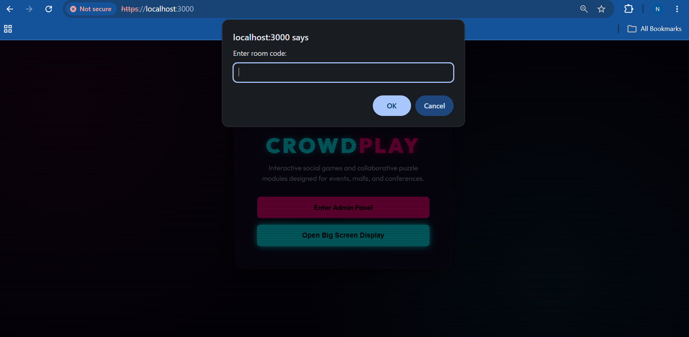
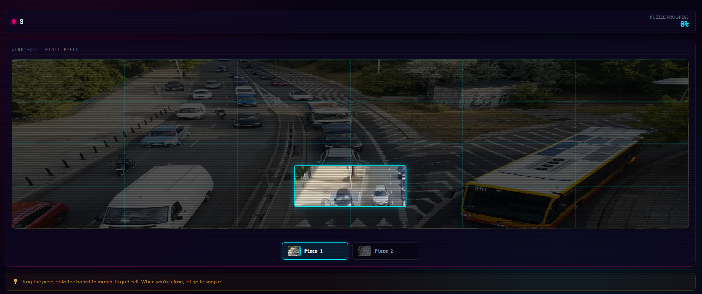
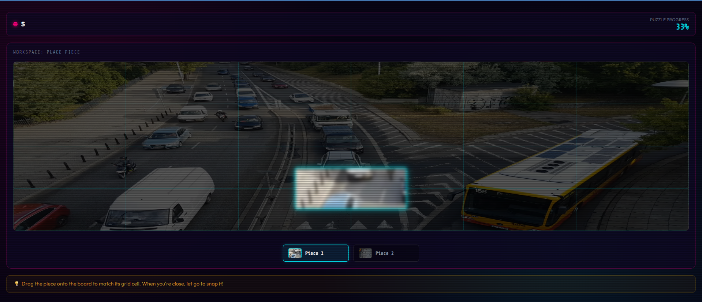
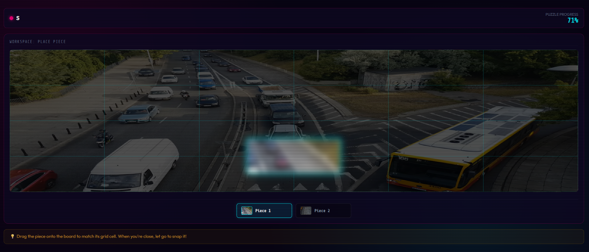

# Submission Notes

This repository is a fork of CrowdPlay completed as part of the internship screening task.

## Changes Made

### 1. Custom Room Code Prompt

Previously, clicking **Open Big Screen Display** redirected users directly to the hardcoded route:

```text
/screen/DEMO
```

This has been updated so that users are prompted to enter a room code before navigating to the screen view.

Behavior:

* Users can enter any room code.
* If no room code is entered, the application falls back to `DEMO`.
* Removes dependence on a hardcoded room.

### 2. Progressive Difficulty System

Added a progressive difficulty mechanism on the mobile controller.

As puzzle completion increases:

* Newly assigned puzzle pieces become increasingly blurred.
* The challenge gradually increases throughout gameplay.
* Players must rely more on observation and teamwork as the puzzle nears completion.

This creates a more engaging experience compared to a constant difficulty level.

---

## Installation & Running

### Prerequisites

* Node.js 14+
* npm

### Install Dependencies

```bash
npm install
```

### Run the Application

```bash
npm run dev
```

### Open the Application

Admin Dashboard:

```text
https://localhost:3000/admin
```

Big Screen View:

```text
https://localhost:3000/screen/DEMO
```

Player Controller:

```text
https://localhost:3000/join/DEMO
```

Default admin password:

```text
admin123
```

---

## Screenshots

### Room Code Prompt



### Big Screen View



### Progressive Difficulty - Early Game



### Progressive Difficulty - Advanced Progress



---

## Assumptions

* Existing room management behavior remains unchanged.
* Room codes are entered manually by the host.
* Difficulty progression is based on puzzle completion progress.

---

## Known Limitations

* Room codes are not validated before navigation.
* Blur-based difficulty is visual only and does not modify puzzle scoring.
* Difficulty settings are currently fixed and not configurable from the admin panel.

